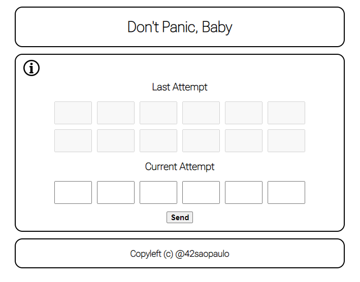

# **Don't Panic, Baby**

The project consists of a full stack application, it has a frontend that contains a small logic game and a backend, which is a simple RESTFUL API.

---

## Technologies used on the project

- <a href="https://spring.io/projects/spring-boot">SpringBoot V.2.6.7</a><br>
- <a href="https://docs.oracle.com/en/java/javase/17/">Java V.17</a><br>
- <a href="https://maven.apache.org/">Maven V.3.8.5</a><br>
- <a href="https://developer.mozilla.org/pt-BR/docs/Web/JavaScript">JavaScript</a><br>
- <a href="https://developer.mozilla.org/en-US/docs/Web/HTML">Html</a><br>
- <a href="https://developer.mozilla.org/en-US/docs/Web/CSS">CSS</a><br>
- <a href="https://github.com/nginx/nginx/tree/e6b3a11581a8040baf7aded3319b0dec433b2461">Nginx V.1.18.0</a><br>

---

## Frontend

The frontend part of the game was built using <a href="https://www.javascript.com/">JavaScript</a>, <a href="https://developer.mozilla.org/en-US/docs/Web/HTML">Html</a> and <a href="https://developer.mozilla.org/en-US/docs/Web/CSS">CSS</a>.
	
<p align=center>

</p>

### Game rules

The main goal of this game is to find the secret equation that results in 42. The player will enter the input in the fields below "Current Attempt". If the equation result is 42 but it is not the correct equation, the blocks above "Current Attempt" will display equation hints. <br><br>

#### Tips
    C: correct position;
    T: wrong position;
    X: It's not part of the secret equation;

#### Valid Inputs
	Numbers: 0-9
	Operators: *, /, +, -

#### Invalid Inputs
	Letters: A-Z, a-z;
	Simbols: all kinds of simbols except operators, for example "&, |, %, $, #, @"

---

## Backend

It's a simple Restful API built with <a href="https://docs.oracle.com/en/java/javase/17/">Java V.17</a> and <a href="https://spring.io/projects/spring-boot">SpringBoot V.2.6.7</a>. It listens the port 8080 for a request from frontend at the **/** endpoint, it returns a Json containing informations about the game. If the Input is valid and it is equal to **42**, it returns the tips.

#### JSON
```json
{
  "input": "string",
  "isFortyTwo": true,
  "isValidInput": true,
  "tips": "string"
}
```

#### Backend documentation

If you want more information about the backend, with the application running you can access it by clicking here: <a href="http://localhost:8080/swagger-ui.html#/baby-controller/getEquationUsingGET">API documentation</a>.

---

## How to run the application

First thing you need to do is clone the repository:

```bash
$ git clone https://github.com/42sp/42labs-dontpanic_baby-27546999.git
```

After that, you run the setup script:

```bash
$ sudo ./baby_setup
```

Now copy and paste the following line on your bash:

```bash
$ firefox --new-window http://localhost
```

If you prefer another browser (Chrome or Firefox are recommended), just open it so you can copy and paste the following URL: `http://localhost`

---

## 🤝 Contributors

The collab:

<table>
  <tr>
    <td>
      <a href="https://github.com/andersonhsporto">
        <br>
        <sub><b>Anderson Porto</b></sub>
      </a>
    </td>
    <td>
      <a href="https://github.com/gustavdlima">
        <br>
        <sub><b>Gustavo Martins</b></sub>
      </a>
    </td>
    <td>
      <a href="https://github.com/hmigl">
        <br>
        <sub><b>Hugo Miguel</b></sub>
      </a>
    </td>
    <td>
      <a href="https://github.com/LacrouxRaoni">
        <br>
        <sub><b>Raoni Lacroux</b></sub>
      </a>
    </td>
    <td>
      <a href="https://github.com/KrebsCoder">
        <br>
        <sub><b>Lucas Krebs</b></sub>
      </a>
    </td>
    <td>
      <a href="https://github.com/Victor-Akio">
        <br>
        <sub><b>Victor Akio</b></sub>
      </a>
    </td>
  </tr>
</table>
